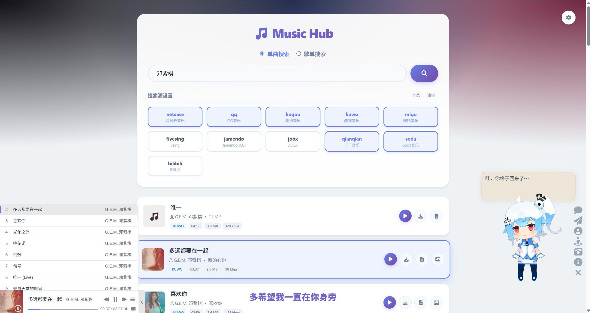

# Go Music DL

Go Music DL 是一个音乐搜索下载工具，支持命令行和网页两种方式。可以搜索下载十多个主流音乐平台的歌曲。


_Web 界面_


_TUI 界面_

## 功能

- **双模式**:
  - **Web 模式**: 启动本地网页服务，在浏览器中搜索、试听、下载，支持歌词
  - **CLI/TUI 模式**: 命令行搜索，或使用 TUI 界面批量下载

- **聚合搜索**: 支持网易云、QQ音乐、酷狗等十多个平台

- **歌单功能**: 支持搜索歌单和获取歌单歌曲

- **下载**:
  - 自动命名: `歌手 - 歌名.mp3`
  - 支持下载封面和歌词
  - 清理文件名中的非法字符

- **在线试听**: Web 模式下有播放器，支持歌词

- **特殊格式**: 支持汽水音乐等平台的加密音频解密

- **免费优先**: 跳过需要 VIP 或付费的歌曲

- **流式转发**: 支持 Range 请求，快速播放

## 开始使用

### 1. 下载

从 [GitHub Releases](https://github.com/guohuiyuan/go-music-dl/releases) 下载最新版本。

### 2. 使用

#### Web 模式

```bash
./music-dl web
```

自动打开浏览器，访问 `http://localhost:8080`。

#### CLI/TUI 模式

```bash
# 搜索 "周杰伦"
./music-dl -k "周杰伦"
```

进入 TUI 界面后，用 `↑` `↓` 键选择歌曲，按 `空格` 选中，按 `回车` 下载。

**其他用法**:
```bash
# 查看帮助
./music-dl -h

# 搜索 "周杰伦 晴天"，指定从 QQ 音乐和网易云
./music-dl -k "周杰伦 晴天" -s qq,netease

# 指定下载目录
./music-dl -k "周杰伦" -o ./my_music

# 下载时包含封面和歌词
./music-dl -k "周杰伦" --cover --lyrics
```

## 支持平台

| 平台 | 模块名 | 搜索 | 下载 | 歌词 | 链接解析 | 歌单搜索 | 歌单歌曲 | 备注 |
| :--- | :--- | :---: | :---: | :---: | :---: | :---: | :---: | :--- |
| 网易云音乐 | `netease` | ✅ | ✅ | ✅ | ✅ | ✅ | ✅ | |
| QQ 音乐 | `qq` | ✅ | ✅ | ✅ | ✅ | ✅ | ✅ | |
| 酷狗音乐 | `kugou` | ✅ | ✅ | ✅ | ✅ | ✅ | ✅ | |
| 酷我音乐 | `kuwo` | ✅ | ✅ | ✅ | ✅ | ✅ | ✅ | |
| 咪咕音乐 | `migu` | ✅ | ✅ | ✅ | ❌ | ✅ | ❌ | |
| 千千音乐 | `qianqian` | ✅ | ✅ | ✅ | ❌ | ❌ | ✅ | |
| 汽水音乐 | `soda` | ✅ | ✅ | ✅ | ✅ | ✅ | ✅ | 支持音频解密 |
| 5sing | `fivesing` | ✅ | ✅ | ✅ | ✅ | ✅ | ✅ | |
| Jamendo | `jamendo` | ✅ | ✅ | ❌ | ✅ | ❌ | ❌ | |
| JOOX | `joox` | ✅ | ✅ | ✅ | ❌ | ✅ | ❌ | |
| Bilibili | `bilibili` | ✅ | ✅ | ❌ | ✅ | ❌ | ❌ | |

## 链接解析

支持直接解析音乐分享链接：

```bash
# 粘贴分享链接
./music-dl -k "https://music.163.com/#/song?id=123456"
```

支持解析的平台：网易云、QQ音乐、酷狗、酷我、咪咕、Bilibili、汽水音乐、5sing、Jamendo。

## 常见问题

**Q: 为什么有些歌搜不到或下载失败？**
A: 可能原因：1) 歌曲需要 VIP 或付费；2) 平台接口变更；3) 网络问题。

**Q: Web 模式启动后页面打不开？**
A: 检查：1) 端口 8080 是否被占用；2) 浏览器插件是否干扰。

**Q: 如何设置 Cookie 获取更高音质？**
A: 在 Web 界面的设置中，可以添加各平台的 Cookie。

## 项目结构

```
go-music-dl/
├── cmd/
│   └── music-dl/       # CLI 命令
│       ├── main.go       # 程序入口
│       ├── root.go       # 主命令
│       └── web.go        # Web 命令
├── core/                 # 核心逻辑
│   └── service.go       # 搜索、源管理
├── internal/
│   ├── cli/              # TUI 界面
│   └── web/              # Web 服务
├── downloads/            # 下载目录
├── screenshots/          # 截图
├── go.mod
└── README.md
```

## 技术栈

- **核心库**: [music-lib](https://github.com/guohuiyuan/music-lib) - 音乐平台搜索下载
- **CLI 框架**: [Cobra](https://github.com/spf13/cobra) - 命令行工具
- **Web 框架**: [Gin](https://github.com/gin-gonic/gin) - Web 框架
- **TUI 框架**: [Bubble Tea](https://github.com/charmbracelet/bubbletea) - 终端界面
- **下载库**: [music-dl](https://github.com/0xHJK/music-dl) - 音乐下载库
- **下载库**: [musicdl](https://github.com/CharlesPikachu/musicdl) - 音乐下载库

## 贡献

欢迎提交 Issue 或 Pull Request。

## 许可证

本项目基于 [CharlesPikachu/musicdl](https://github.com/CharlesPikachu/musicdl) 的核心设计思路开发，遵循 [PolyForm Noncommercial License 1.0.0](https://polyformproject.org/licenses/noncommercial/1.0.0) 协议，禁止任何商业使用。

## 免责声明

本项目仅供个人学习和技术交流使用。请在遵守相关法律法规的前提下使用。通过本工具下载的音乐资源，请于 24 小时内删除。